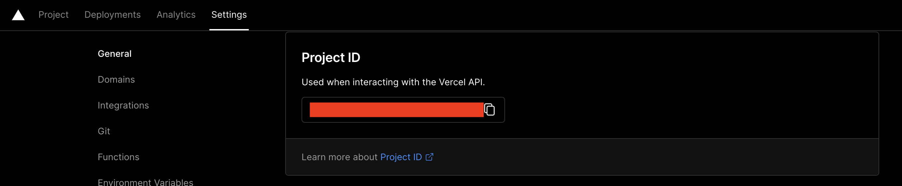

1. Go to your Project settings, you'll want to copy the project id (Project Settings > General > Project Id). Save this for later.
   

 <iframe title="IBM PCjr 4863 Computer-Freepoly.org" frameborder="0" allowfullscreen mozallowfullscreen="true" webkitallowfullscreen="true" allow="autoplay; fullscreen; xr-spatial-tracking" xr-spatial-tracking execution-while-out-of-viewport execution-while-not-rendered web-share width="1200" height="980" src="https://sketchfab.com/models/1c3c3cd0643d44d49a1771048da74c62/embed"> </iframe> 
 <a href="https://sketchfab.com/3d-models/ibm-pcjr-4863-computer-freepolyorg-1c3c3cd0643d44d49a1771048da74c62?utm_medium=embed&utm_campaign=share-popup&utm_content=1c3c3cd0643d44d49a1771048da74c62" target="_blank" rel="nofollow" style="font-weight: bold; color: #1CAAD9;"> IBM PCjr 4863 Computer-Freepoly.org </a> by <a href="https://sketchfab.com/blackrray?utm_medium=embed&utm_campaign=share-popup&utm_content=1c3c3cd0643d44d49a1771048da74c62" target="_blank" rel="nofollow" style="font-weight: bold; color: #1CAAD9;"> Freepoly.org </a> on <a href="https://sketchfab.com?utm_medium=embed&utm_campaign=share-popup&utm_content=1c3c3cd0643d44d49a1771048da74c62" target="_blank" rel="nofollow" style="font-weight: bold; color: #1CAAD9;">Sketchfab</a>

