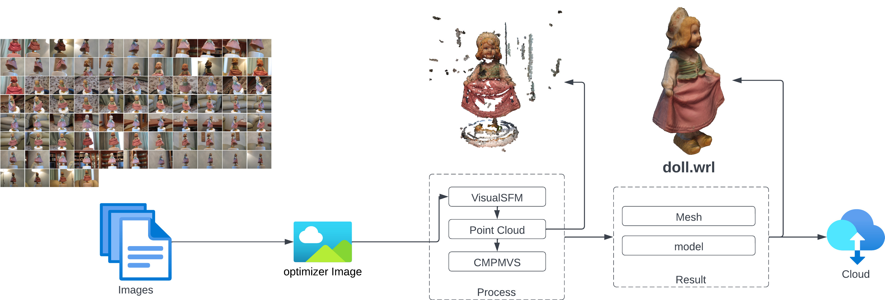
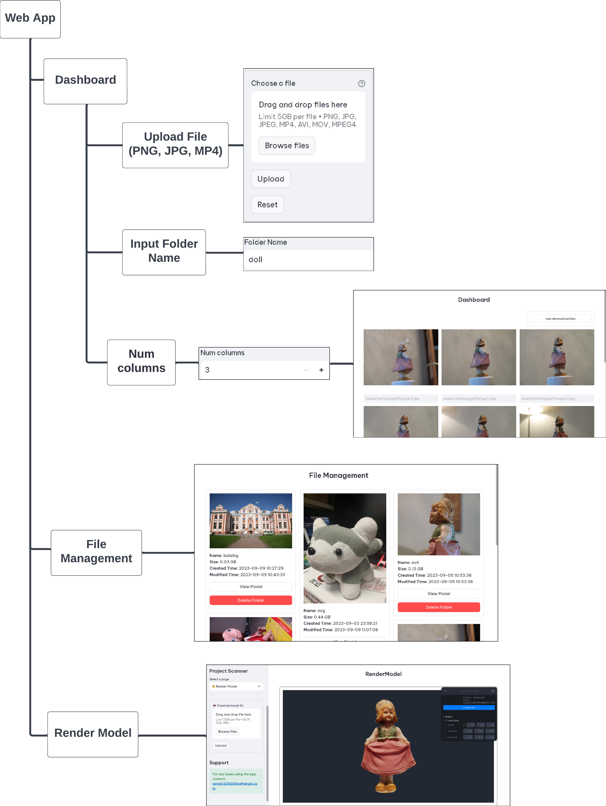

## Giới thiệu

Trong thời đại số hóa ngày nay, việc bảo tồn và truyền tải di sản văn hóa đang đối diện với những cơ hội và thách thức mới. Bảo tàng trực tuyến và ứng dụng công nghệ online đã trở thành một phần quan trọng trong việc bảo tồn và chia sẻ với cộng đồng trên toàn cầu về di sản là một nhiệm vụ mới đặt ra cho chúng ta trong bối cảnh của Cách mạng 4.0. Tuy nhiên, việc thu thập thông tin và dữ liệu về các di vật, tác phẩm nghệ thuật trong thời gian qua không đáp ứng được yêu cầu của việc số hóa hiện nay. Hơn nữa, việc bảo tồn và phục dựng các tác phẩm nghệ trong bảo tàng vẫn thường gặp rất nhiều khó khăn. Các công cụ đo đạc truyền thống không đem lại sự kỳ trong không gian ảo và đòi hỏi cần phải có những ý tưởng, mô hình và công cụ phục dựng các di vật, tác phẩm nghệ thuật một cách hiệu quả với chi phí thấp. Điều này đặt ra một thách thức lớn và nhiệm vụ cần giải quyết một cách hiệu quả.
  
Vì thế mà ý tưởng về “Ứng dụng Structure from Motion (SfM) trong việc phát triển hệ thống bảo tàng trực tuyến”. Ứng dụng này có thể biến những bức ảnh chụp được từ bảo tàng được chuyển thành vật thể 3D bằng cách kết hợp dữ liệu hình ảnh và thuật toán Sfm. Thành quả này giúp cho việc bảo tồn và chia sẻ di vật lịch sử, di sản văn hóa ở bất kỳ nơi nào đều được đưa đến với mọi người. Đồng thời, ứng dụng này có tính tiện lợi cao, mang đến trải nghiệm tốt hơn cho người tham quan thông qua hệ thống trực tuyến với giá thành siêu tiết kiệm.

|  |
|:-------------------------------------:|
|          Quy trình hoạt động          |

Hệ thống được thiết kế đơn giản, dễ sử dụng và vận hành với chi phí thấp nhàm tiết kiệm kinh phí cho các bảo tàng.

|  |
| ------------------------------------------ |
| Giao diện ứng dụng                         |

## Một số sản phẩm

Ứng dụng trên được thực nghiệm tại Bảo tàng Lịch sử Việt Nam. Sau đây là một số vật mẫu được nhóm nghiên cứu xử lý và phục hồi thành hình ảnh 3D.

<iframe width="560" height="315" src="https://www.youtube.com/embed/k45XU3cbp4o?si=6j8PFR9VqDvmJRV7" title="YouTube video player" frameborder="0" allow="accelerometer; autoplay; clipboard-write; encrypted-media; gyroscope; picture-in-picture; web-share" allowfullscreen></iframe>